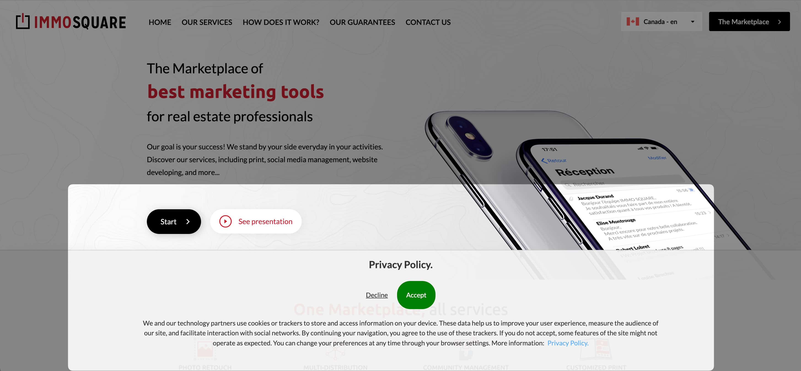

# immosquare Cookies Consent Banner
Easily integrate a customizable cookie consent banner in your Ruby on Rails application.

## 🌍 Available Languages

The gem is available in the following languages:
- 🇫🇷 French (fr)
- 🇬🇧 English (en)
- 🇪🇸 Spanish (es)
- 🇳🇱 Dutch (nl)
- 🇮🇹 Italian (it)
- 🇨🇳 Simplified Chinese (zh)
- 🇹🇼 Traditional Chinese (zh-TW)

---

## 🚀 Installation

Ensure you have the compatible versions of Ruby and Rails before installation.

Add the following line to your `Gemfile`:

```bash
gem "immosquare-cookies"
```

Then run:

```bash
bundle install
```

---

## 🎨 Styles Integration

For proper styling, include the `immosquare-cookies.scss` stylesheet. Depending on your Rails version, the way to include it varies:

### Rails 5

Add to your application's CSS manifest (usually `application.css`):

```css
*= require immosquare-cookies

```

### Rails 6 and Above

Make sure that SASS has access to all of Rails' assets (`Rails.application.config.assets`). Set it up using [cssbundling-rails](https://github.com/rails/cssbundling-rails):

1. In the script section of `package.json`, invoke:

```json
"scripts": {
    ...
    "build:css": "ruby datas/compile_sass.rb",
    "build:css-dev": "ruby datas/compile_sass.rb development"
}
```

2. Place the Ruby script, `data/compile_sass.rb`, in the appropriate directory:

```ruby
#!/usr/bin/env ruby

# Require the environment to have access to the application's constants.
require_relative "../config/environment"

# Create the command to execute with all the application's paths (gems, node_modules, etc.)
cmd = "sass ./app/assets/stylesheets/application.sass.scss ./app/assets/builds/application.css #{Rails.application.config.assets.paths.map {|path| "--load-path=#{path}" }.join(" ")}"
cmd += ARGV[0] == "development" ? " --source-map --source-map-urls=absolute --watch" : " --style compressed"

# Execute the command.
system(cmd)
```

3. Update your `Procfile`:

```plaintext
puma:     bundle exec puma -C config/puma/development.rb
sidekiq:  bundle exec sidekiq -e development
css:      bun build:css-dev
js:       bun build-dev --watch
```

---

## 🛠 Usage

Display the consent banner by adding to your application layout or specific view:

```ruby
<%= render("immosquare-cookies/consent_banner") %>
```

Or with custom links:

```ruby
<%= render("immosquare-cookies/consent_banner",
    :privacy_policy_link => "https://example.com/privacy",
    :cookie_policy_link  => "https://example.com/cookies") %>
```

---

## 🍪 Conditional Script Loading based on Cookie Consent

If a user has refused the cookie, you might choose not to load certain scripts, such as those from Google Analytics. Here's a simple example using Rails' ERB template:

```erb
<% if cookies["_immosquare_consented"] != "false" %>
  <script async src="https://www.googletagmanager.com/gtag/js?id=G-AAAAAAAA"></script>
<% end %>
```

In the example above, the Google Analytics script will only be loaded if the user has not explicitly refused the cookies.


## 🎥 Demo

For a visual demonstration, check out the image below or experience it firsthand by [visiting our website](https://immosquare.com).




## Customization

Customize the banner's appearance and text using these options:

Option | Default | Description
------|---------|------------

`:key`| "_immosquare_consented" | Cookie name storing the user's decision.
`:duration_months` | 6 | Duration in months for the consent cookie.
`:document_name` | Localized string | Title at the banner's top.
`:site_name` | `request.host` | Site name displayed in the title.
`:refuse` | Localized string | "Refuse" button text.
`:accept` | Localized string | "Accept" button text.
`:text` | Localized string | Banner's content text.
`:privacy_policy_link` | - | URL for the privacy policy document.
`:cookie_policy_link` | - | URL for the cookie policy document.
`:privacy_policy` | Localized string | Custom text for privacy policy link.
`:cookie_policy` | Localized string | Custom text for cookie policy link.
`:link_text` | Localized string | Text displayed before the links.
`:target` | "_blank" | Link's target, e.g., "_blank" for a new tab.

### Backward Compatibility

The gem maintains full backward compatibility with the old `:link` parameter:

```ruby
<%= render("immosquare-cookies/consent_banner", :link => "https://legals.immosquare.com") %>
```

### Example with Custom Links

```ruby
<%= render("immosquare-cookies/consent_banner",
    :site_name           => "MyWebsite.com",
    :privacy_policy_link => "https://mywebsite.com/legal/privacy",
    :cookie_policy_link  => "https://mywebsite.com/legal/cookies",
    :duration_months     => 6,
    target: "_blank") %>
```

---

## Styling

The gem includes its own CSS. The banner uses a clean, modern design with:

- **Position**: Fixed at bottom-left
- **Responsive**: Adapts to mobile screens
- **Typography**: Clean, readable fonts

---

## Internationalization

This gem is i18n-ready. If you don't pass custom text, it will use default translations. Customize translations by adding the appropriate keys to your app's localization files.

The default keys used by the gem are:

- `immosquare-cookies.document_title`
- `immosquare-cookies.refuse`
- `immosquare-cookies.accept`
- `immosquare-cookies.text`
- `immosquare-cookies.link_text`
- `immosquare-cookies.privacy_policy`
- `immosquare-cookies.cookie_policy`

---

## Support & Contribution

For bugs or feature requests, open an issue on [GitHub](https://github.com/immosquare/immosquare-cookies).

---

## License

This gem is under the [MIT License](https://opensource.org/licenses/MIT).
