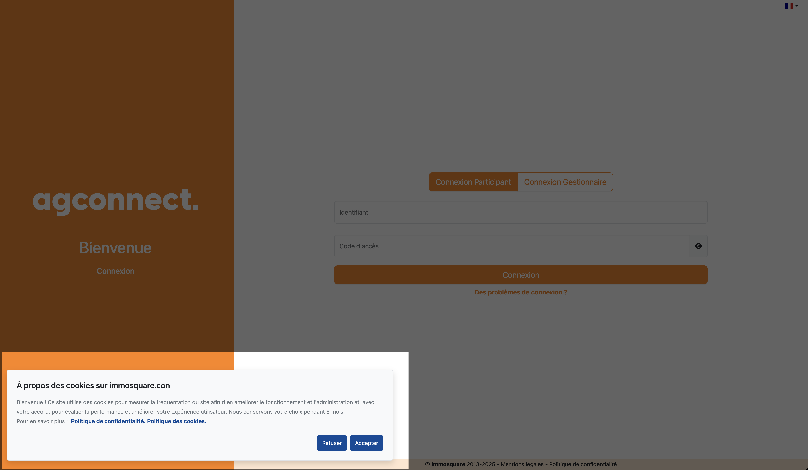

# 🍪 immosquare-cookies

**A modern, GDPR-compliant cookie consent banner for Rails applications**


Easily integrate a customizable, fully-featured cookie consent banner in your Ruby on Rails application. Built with modern web standards, responsive design, and complete GDPR compliance in mind.



## ✨ Features

- 🌍 **Multi-language support** - 7 languages built-in (FR, EN, ES, NL, IT, ZH, ZH-TW)
- 🎨 **Modern responsive design** - Clean, accessible UI that works on all devices
- 🍪 **Smart cookie management** - Automatically remove specific cookies when consent is refused
- ⚙️ **Highly customizable** - Customize text, links, duration, and appearance
- 🚀 **Zero dependencies** - Pure JavaScript, no external libraries required
- 📱 **Mobile optimized** - Touch-friendly interface with responsive breakpoints

## Quick Start

```ruby
gem "immosquare-cookies"
```

Add to your layout or view:

```erb
<%= render("immosquare-cookies/consent_banner") %>
```

## 📦 Installation

### Rails 6+ with modern bundling

For modern Rails applications using `cssbundling-rails` or similar:

1. Add the following to your `package.json` scripts:

```json
{
  "scripts": {
    "build:css": "ruby scripts/compile_sass.rb",
    "build:css-dev": "ruby scripts/compile_sass.rb development"
  }
}
```

2. Create `scripts/compile_sass.rb`:

```ruby
#!/usr/bin/env ruby

require_relative "../config/environment"

cmd = "sass ./app/assets/stylesheets/application.sass.scss ./app/assets/builds/application.css #{Rails.application.config.assets.paths.map {|path| "--load-path=#{path}" }.join(" ")}"
cmd += ARGV[0] == "development" ? " --source-map --source-map-urls=absolute --watch" : " --style compressed"

system(cmd)
```

3. Update your `Procfile.dev`:

```
web: bin/rails server -p 3000
css: bun run build:css-dev
js: bun run build-dev --watch
```


## 🎯 Usage

### Basic usage

```erb
<%= render("immosquare-cookies/consent_banner") %>
```

### With privacy and cookie policy links

```erb
<%= render("immosquare-cookies/consent_banner",
    privacy_policy_link: "https://example.com/privacy",
    cookie_policy_link: "https://example.com/cookies") %>
```

### Advanced usage with cookie management

```erb
<%= render("immosquare-cookies/consent_banner",
    site_name: "MyApp",
    duration_months: 12,
    privacy_policy_link: "https://example.com/privacy",
    cookie_policy_link: "https://example.com/cookies",
    cookies_to_remove: ["_ga", "_gid", "_fbp", "_gat"],
    target: "_blank") %>
```

## 🍪 Smart Cookie Management

**New in v2.0!** The `cookies_to_remove` parameter automatically removes unwanted cookies when users refuse consent.

```erb
<%= render("immosquare-cookies/consent_banner",
    cookies_to_remove: ["_ga", "_gid", "_fbp", "_gat_UA-*"]) %>
```

This prevents tracking cookies from being recreated and ensures true GDPR compliance.

### Conditional script loading

Check consent before loading tracking scripts:

```erb
<% if cookies["_immosquare_consented"] != "false" %>
  <!-- Google Analytics -->
  <script async src="https://www.googletagmanager.com/gtag/js?id=GA_MEASUREMENT_ID"></script>
  <script>
    window.dataLayer = window.dataLayer || [];
    function gtag(){dataLayer.push(arguments);}
    gtag('js', new Date());
    gtag('config', 'GA_MEASUREMENT_ID');
  </script>
<% end %>
```

## ⚙️ Configuration Options

| Parameter             | Type    | Default                   | Description                          |
| --------------------- | ------- | ------------------------- | ------------------------------------ |
| `key`                 | String  | `"_immosquare_consented"` | Cookie name storing consent decision |
| `duration_months`     | Integer | `6`                       | Cookie duration (1-12 months)        |
| `site_name`           | String  | `request.host`            | Site name in banner title            |
| `text`                | String  | Localized                 | Custom banner text                   |
| `privacy_policy_link` | String  | `nil`                     | URL to privacy policy                |
| `cookie_policy_link`  | String  | `nil`                     | URL to cookie policy                 |
| `cookies_to_remove`   | Array   | `[]`                      | Cookies to remove on refusal         |
| `refuse`              | String  | Localized                 | "Refuse" button text                 |
| `accept`              | String  | Localized                 | "Accept" button text                 |
| `link_text`           | String  | Localized                 | Text before policy links             |
| `privacy_policy`      | String  | Localized                 | Privacy policy link text             |
| `cookie_policy`       | String  | Localized                 | Cookie policy link text              |
| `target`              | String  | `"_blank"`                | Link target attribute                |

## 🌍 Internationalization

Built-in translations for 7 languages:
- 🇫🇷 French (fr)
- 🇬🇧 English (en)
- 🇪🇸 Spanish (es)
- 🇳🇱 Dutch (nl)
- 🇮🇹 Italian (it)
- 🇨🇳 Simplified Chinese (zh)
- 🇹🇼 Traditional Chinese (zh-TW)

### Translation keys

Customize translations in your app's locale files:

```yaml
en:
  immosquare-cookies:
    document_title: "Cookie Settings for %{site_name}"
    text: "We use cookies to enhance your experience. By continuing to visit this site, you agree to our use of cookies for %{duration_months} months."
    refuse: "Refuse"
    accept: "Accept"
    link_text: "Learn more:"
    privacy_policy: "Privacy Policy"
    cookie_policy: "Cookie Policy"
```

## 🎨 Styling & Design

The banner features a modern, accessible design with:

- **Clean card-based layout** with subtle shadows
- **Responsive breakpoints** for mobile and desktop
- **CSS custom properties** for easy theming
- **Smooth animations** and hover effects
- **Fixed bottom-left positioning** (non-intrusive)

### Custom styling

Override CSS custom properties:

```css
#immosquare-cookies-container {
  --immosquare-cookies-color: #your-brand-color;
  --immosquare-cookies-bg: #your-background;
  --immosquare-cookies-border: #your-border-color;

}
```

## 🚀 Upgrading to v2.0

immosquare-cookies v2.0 includes breaking changes and major improvements.

**📖 [View complete migration guide →](docs/2.0-Upgrade.md)**

### Quick migration checklist:

- [ ] Update gem version: `gem "immosquare-cookies", "~> 2.0"`
- [ ] Replace `link:` parameter with `privacy_policy_link:` and `cookie_policy_link:`
- [ ] Test banner display and functionality
- [ ] Add `cookies_to_remove:` for automatic GDPR compliance

## 💡 Examples

### E-commerce site with Google Analytics

```erb
<%= render("immosquare-cookies/consent_banner",
    site_name: "MyShop",
    duration_months: 6,
    privacy_policy_link: "https://myshop.com/privacy",
    cookie_policy_link: "https://myshop.com/cookies",
    cookies_to_remove: ["_ga", "_gid", "_gat", "_fbp"]) %>
```

### SaaS application

```erb
<%= render("immosquare-cookies/consent_banner",
    site_name: "MySaaS Pro",
    duration_months: 12,
    text: "We use essential and analytics cookies to improve your experience.",
    privacy_policy_link: "https://mysaas.com/legal/privacy",
    cookies_to_remove: ["_ga", "_gid", "intercom-session"]) %>
```

## 🔧 Development

```bash
# Clone the repository
git clone https://github.com/immosquare/immosquare-cookies.git

# Build the gem
gem build immosquare-cookies.gemspec

# Install locally
gem install immosquare-cookies-2.0.0.gem
```

## 📄 License

This project is licensed under the MIT License - see the [LICENSE](https://opensource.org/licenses/MIT) for details.

## 🤝 Contributing

Bug reports and pull requests are welcome on [GitHub](https://github.com/immosquare/immosquare-cookies).

---

Made with ❤️ by the [immosquare](https://immosquare.com) team
