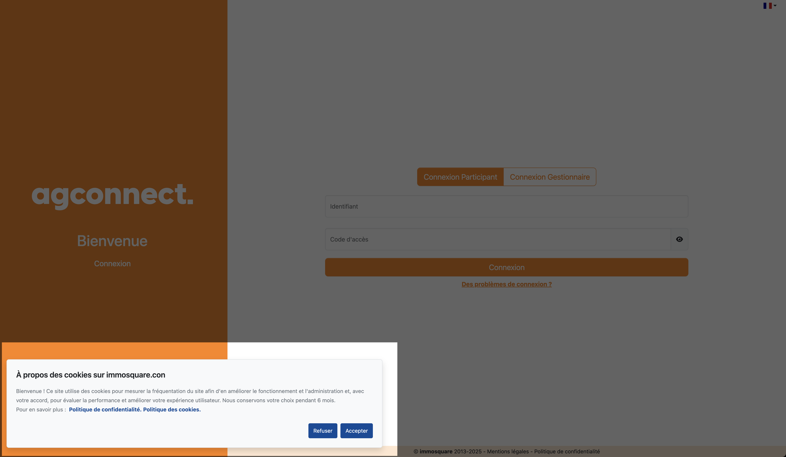

# 🍪 immosquare-cookies

**A modern, GDPR-compliant cookie consent banner for Rails applications**

Easily integrate a customizable, fully-featured cookie consent banner in your Ruby on Rails application. Built with modern web standards, responsive design, and complete GDPR compliance in mind.



## ✨ Features

- 🌍 **Multi-language support** - 8 languages built-in (FR, EN, ES, NL, PL, IT, ZH, ZH-TW)
- 🎨 **Modern responsive design** - Clean, accessible UI that works on all devices
- 🍪 **Smart cookie management** - Automatically remove specific cookies when consent is refused
- 📊 **Google Consent Mode v2** - Calls `gtag('consent', 'update', ...)` on accept/refuse with the 4 required signals
- ⚙️ **Highly customizable** - Customize text, links, duration, and appearance
- 🚀 **Zero front-end dependencies** - Pure JavaScript, no external libraries required
- ⚡ **Turbo Drive compatible** - Works seamlessly with Hotwire/Turbo navigation
- 📱 **Mobile optimized** - Touch-friendly interface with responsive breakpoints

## Quick Start

```ruby
gem "immosquare-cookies"
```

Add to your layout or view:

```erb
<%= render("immosquare-cookies/consent_banner") %>
```

## 📦 Installation

### Requirements

| Requirement | Version    |
| ----------- | ---------- |
| Ruby        | `>= 2.6.0` |
| `railties`  | `>= 6.0`   |

`railties` is the only runtime dependency: the gem ships a `Rails::Engine` so its views, stylesheet and locales are picked up by the host application automatically.

### Rails 6+ with modern bundling

For modern Rails applications using `cssbundling-rails` or similar:

1. Add the following to your `package.json` scripts:

```json
{
  "scripts": {
    "build:css": "ruby scripts/compile_sass.rb",
    "build:css-dev": "ruby scripts/compile_sass.rb development"
  }
}
```

2. Create `scripts/compile_sass.rb`:

```ruby
#!/usr/bin/env ruby

require_relative "../config/environment"

cmd = "sass ./app/assets/stylesheets/application.sass.scss ./app/assets/builds/application.css #{Rails.application.config.assets.paths.map {|path| "--load-path=#{path}" }.join(" ")}"
cmd += ARGV[0] == "development" ? " --source-map --source-map-urls=absolute --watch" : " --style compressed"

system(cmd)
```

3. Update your `Procfile.dev`:

```
web: bin/rails server -p 3000
css: bun run build:css-dev
js: bun run build-dev --watch
```

4. Import the banner stylesheet in `app/assets/stylesheets/application.sass.scss`:

```scss
@import "immosquare-cookies";
```

The engine adds its own `app/assets/stylesheets` to `Rails.application.config.assets.paths`, which the script above turns into `--load-path` flags — that is what makes the bare `immosquare-cookies` name resolve.

## 🎯 Usage

### Basic usage

```erb
<%= render("immosquare-cookies/consent_banner") %>
```

### With privacy and cookie policy links

```erb
<%= render("immosquare-cookies/consent_banner",
    privacy_policy_link: "https://example.com/privacy",
    cookie_policy_link: "https://example.com/cookies") %>
```

### Advanced usage with cookie management

```erb
<%= render("immosquare-cookies/consent_banner",
    site_name: "MyApp",
    duration_months: 12,
    privacy_policy_link: "https://example.com/privacy",
    cookie_policy_link: "https://example.com/cookies",
    cookies_to_remove: ["_ga", "_gid", "_fbp", "_gat"],
    target: "_blank") %>
```

## 🍪 Smart Cookie Management

**New in v2.0!** The `cookies_to_remove` parameter automatically removes unwanted cookies when users refuse consent.

```erb
<%= render("immosquare-cookies/consent_banner",
    cookies_to_remove: ["_ga", "_gid", "_fbp", "_gat"]) %>
```

Names are matched **exactly** — wildcards and prefixes are not supported, so list every cookie you want removed. Each one is expired on the current domain, on `.example.com` and on `.example.co.uk`, with both `expires` and `Max-Age=0`, so it is removed whichever way it was set.

This prevents tracking cookies from being recreated and ensures true GDPR compliance.

## 📊 Google Consent Mode v2

**New in v2.0.4!** When the user clicks accept or refuse, the banner automatically updates the Google Consent Mode v2 signals if `gtag` is defined on the page:

```js
gtag("consent", "update", {
  analytics_storage:  "granted" | "denied",
  ad_storage:         "granted" | "denied",
  ad_user_data:       "granted" | "denied",
  ad_personalization: "granted" | "denied"
})
```

No configuration required — the integration is triggered as soon as `gtag` is available. Declare the Google tag (gtag.js) on the page **before** the banner renders so its default consent state can be picked up.

### Conditional script loading

Check consent before loading tracking scripts:

```erb
<% if cookies["_immosquare_consented"] != "false" %>
  <!-- Google Analytics -->
  <script async src="https://www.googletagmanager.com/gtag/js?id=GA_MEASUREMENT_ID"></script>
  <script>
    window.dataLayer = window.dataLayer || [];
    function gtag(){dataLayer.push(arguments);}
    gtag('js', new Date());
    gtag('config', 'GA_MEASUREMENT_ID');
  </script>
<% end %>
```

## ⚙️ Configuration Options


| Parameter             | Type    | Default                   | Description                          |
| --------------------- | ------- | ------------------------- | ------------------------------------ |
| `key`                 | String  | `"_immosquare_consented"` | Cookie name storing consent decision |
| `duration_months`     | Integer | `6`                       | Cookie duration (1-12 months)        |
| `site_name`           | String  | `request.host`            | Site name in banner title            |
| `text`                | String  | Localized                 | Custom banner text                   |
| `privacy_policy_link` | String  | `nil`                     | URL to privacy policy                |
| `cookie_policy_link`  | String  | `nil`                     | URL to cookie policy                 |
| `cookies_to_remove`   | Array   | `[]`                      | Cookies to remove on refusal         |
| `refuse`              | String  | Localized                 | "Refuse" button text                 |
| `accept`              | String  | Localized                 | "Accept" button text                 |
| `link_text`           | String  | Localized                 | Text before policy links             |
| `privacy_policy`      | String  | Localized                 | Privacy policy link text             |
| `cookie_policy`       | String  | Localized                 | Cookie policy link text              |
| `target`              | String  | `"_blank"`                | Link target attribute                |

## 🌍 Internationalization

Built-in translations for 8 languages:

- 🇫🇷 French (fr)
- 🇬🇧 English (en)
- 🇪🇸 Spanish (es)
- 🇳🇱 Dutch (nl)
- 🇵🇱 Polish (pl)
- 🇮🇹 Italian (it)
- 🇨🇳 Simplified Chinese (zh)
- 🇹🇼 Traditional Chinese (zh-TW)

### Translation keys

Customize translations in your app's locale files:

```yaml
en:
  immosquare-cookies:
    document_title: "About cookies on %{site_name}"
    text: "Welcome! This site uses cookies to measure site traffic in order to improve its operation and administration and, with your consent, to evaluate performance and improve your user experience. We keep your choice for %{duration_months} months."
    accept: "Accept"
    refuse: "Decline"
    link_text: "More information:"
    privacy_policy: "Privacy Policy."
    cookie_policy: "Cookie Policy."
```

`document_title` and `text` are the only keys taking an interpolation: `%{site_name}` and `%{duration_months}` respectively. Both come from the render parameters, so a translation that drops them silently loses the information.

## 🎨 Styling & Design

The banner features a modern, accessible design with:

- **Clean card-based layout** with subtle shadows
- **Responsive breakpoints** for mobile and desktop
- **CSS custom properties** for easy theming
- **Smooth animations** and hover effects
- **Fixed bottom-left positioning** (non-intrusive)

### Custom styling

Override CSS custom properties:

```css
#immosquare-cookies-container {
  --immosquare-cookies-color:       #your-brand-color;       /* Link + button background */
  --immosquare-cookies-color-hover: #your-brand-hover-color; /* Defaults to color mixed with 10% black */
  --immosquare-cookies-bg:          #your-background;        /* Card background */
  --immosquare-cookies-border:      #your-border-color;      /* Card border */
  --immosquare-cookies-text:        #your-text-color;        /* Body text */
  --immosquare-cookies-btn-color:   #your-button-text-color; /* Button text */
}
```

## 🚀 Upgrading to v2.0

immosquare-cookies v2.0 includes breaking changes and major improvements.

**📖 [View complete migration guide →](docs/2.0-Upgrade.md)**

### Quick migration checklist:

- [ ]  Update gem version: `gem "immosquare-cookies", "~> 2.0"`
- [ ]  Replace `link:` parameter with `privacy_policy_link:` and `cookie_policy_link:`
- [ ]  Test banner display and functionality
- [ ]  Add `cookies_to_remove:` for automatic GDPR compliance

## 💡 Examples

### E-commerce site with Google Analytics

```erb
<%= render("immosquare-cookies/consent_banner",
    site_name: "MyShop",
    duration_months: 6,
    privacy_policy_link: "https://myshop.com/privacy",
    cookie_policy_link: "https://myshop.com/cookies",
    cookies_to_remove: ["_ga", "_gid", "_gat", "_fbp"]) %>
```

### SaaS application

```erb
<%= render("immosquare-cookies/consent_banner",
    site_name: "MySaaS Pro",
    duration_months: 12,
    text: "We use essential and analytics cookies to improve your experience.",
    privacy_policy_link: "https://mysaas.com/legal/privacy",
    cookies_to_remove: ["_ga", "_gid", "intercom-session"]) %>
```

## 🔧 Development

```bash
# Clone the repository
git clone https://github.com/immosquare/immosquare-cookies.git
cd immosquare-cookies
bundle install

# Build the gem
gem build immosquare-cookies.gemspec

# Install locally (replace <version> with the version printed by `gem build`)
gem install immosquare-cookies-<version>.gem
```

### Running the tests

The suite runs on RSpec. `.rspec` requires `coverage_helper` before `spec_helper`, so coverage sees the library being loaded rather than an already-required file.

```bash
bundle exec rspec
```

Coverage is opt-in through an environment variable, which keeps a local run fast and leaves no `coverage/` directory behind:

```bash
COVERAGE=true bundle exec rspec   # writes coverage/lcov.info and an HTML report
```

`bin/ci` is the entry point used by both a laptop and the build agent — everything agent-specific is skipped when `JENKINS_WORKSPACE` is unset:

| Command       | What it does                                     |
| ------------- | ------------------------------------------------ |
| `bin/ci init` | `bundle install` without the `development` group |
| `bin/ci test` | `bundle exec rspec`                              |

Anything the specs need belongs to the `test` group of the `Gemfile`, never to `development`: the CI installs without that group, and a bundler asked to materialize a group it skipped aborts on `GemNotFound`.

The `Jenkinsfile` chains the two commands and publishes `coverage/lcov.info` to the Jenkins coverage report. The Ruby it runs is the one pinned in `.ruby-version`, in the gemset named by `.ruby-gemset`.

## 📄 License

This project is licensed under the MIT License - see the [LICENSE](https://opensource.org/licenses/MIT) for details.

## 🤝 Contributing

Bug reports and pull requests are welcome on [GitHub](https://github.com/immosquare/immosquare-cookies).

---

Made with ❤️ by the [immosquare](https://immosquare.com) team
